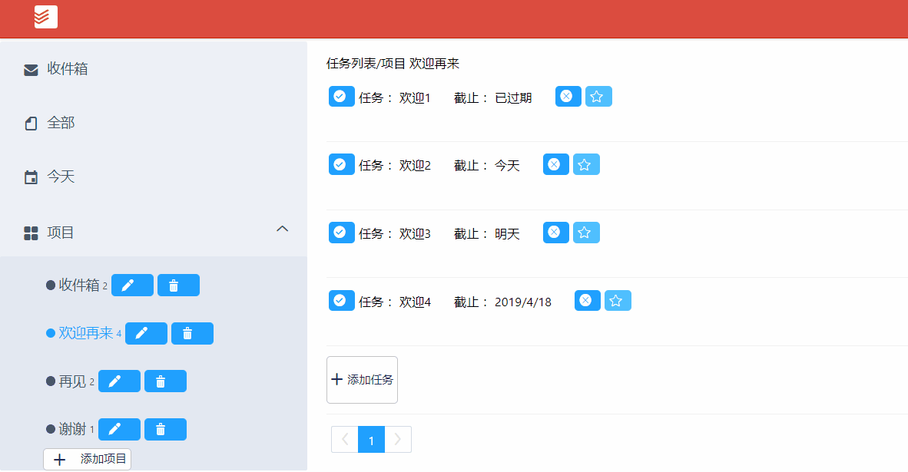

# todoist
## demo 
http://112.74.160.190/todoist/index.html

- 增加一个待办事项

---
- 删除一个待办事项

---
- 标记一个待办事项为已完成

---
- 编辑一个待办事项的具体内容

---
- 列出所有的待办事项

---
- 支持翻页

---
- 待办事项设置优先级

---
- 待办事项设置expire date

---
- 项目管理

